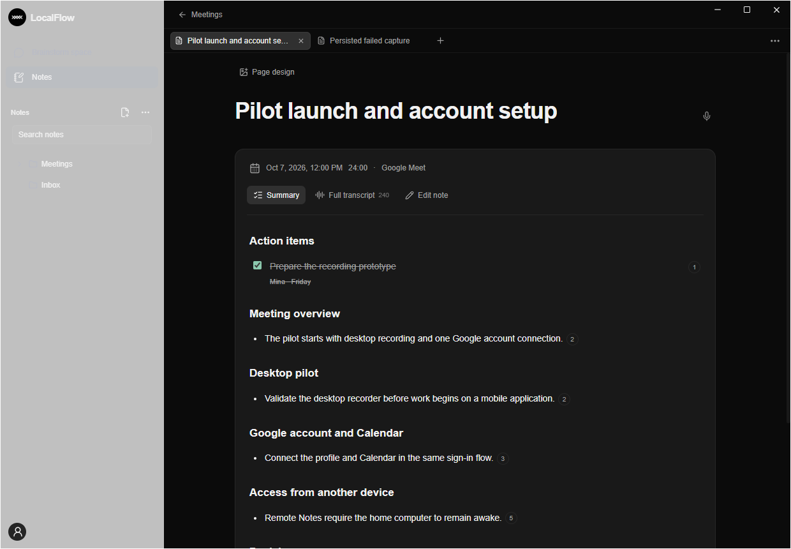
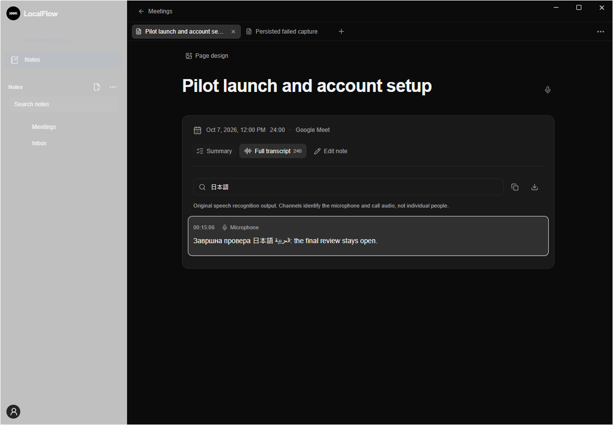

# LocalFlow 0.3.1 — meetings

Implementacija i provera: 7. oktobar 2026. Aktivni izvor je `X:\wORK cODEX\localflow`, grana `codex/windows-native-rework`.

## Kako se koristi

Bočni notch zadržava položaj i topmost ponašanje. Dugme **Transcribe** otvara izbor aplikacije i mikrofona. Potvrđen browser poziv ili podsetnik iz kalendara može da proširi isti notch kroz morph animaciju od 620 ms. Zeleno ✓ prihvata ponudu; × je odbija za taj razgovor. Ako izvor zvuka nije jednoznačan, ✓ prvo otvara izbor izvora. Pre potvrde se audio ne snima.

Tokom snimanja dostupni su pauza, nastavak, zasebno utišavanje LocalFlow mikrofona i završetak. Mikrofon i zvuk aplikacije zapisuje native WASAPI recorder u odvojene trajne delove od 15 sekundi. Može se izabrati i zvuk celog računara. Podrška za process loopback proverava se aktiviranjem odgovarajućeg Windows interfejsa bez početka snimanja; potreban je Windows build 20348 ili noviji. Browser proces može obuhvatiti više tabova.

Whisper obrađuje govor lokalno sa automatskim prepoznavanjem jezika, nezavisno od jezika običnog diktiranja. Zapis i obrada rade odvojeno: sporiji model povećava red obrade. Potvrđeno zapisani delovi i transkripti ostaju dostupni posle prekida, a pokretanje aplikacije nastavlja obradu bez ponovnog uključivanja mikrofona. Obrada sastanka ima sopstvene ID-jeve poslova; zaustavljanje diktiranja ne otkazuje sastanak.

Ako se prekine samo Node host dok native recorder i dalje snima, host se ponovo povezuje sa istom aktivnom sesijom. Ne obrađuje njene otvorene `.part` fajlove dok recorder ne završi zapis. Posebno su provereni snimanje, pauza, nastavak reda transkripcije i Stop posle tog ponovnog povezivanja. Nepoznato aktivno snimanje prvo se zaustavlja; neuspešna provera ili nepotvrđen Stop ne proglašavaju oporavak uspešnim.

U **Notes / Meetings** nastaje jedna beleška po sesiji. Po završetku Codex obrađuje tekst preko postojećeg naloga. To je obrada u oblaku; lokalna transkripcija i čuvanje ne zahtevaju uspešan AI sažetak. Ako obrada nije dostupna, transkript ostaje sačuvan i sažetak se može ponoviti.

## Izgled beleške prema dostavljenom Notion primeru

Podrazumevani **Summary** prikazuje obaveze sa checkboxovima, pregled razgovora, odvojene teme, odluke, otvorena pitanja i naredne korake. Teme i naslovi nastaju iz sadržaja razgovora, bez lista srpskih ili engleskih ključnih reči. Jezik sažetka može ostati automatski ili se zadati u Meetings podešavanjima.

Brojevi uz stavke otvaraju tačan izvor u **Full transcript**. Taj prikaz ima vremenske oznake, pretragu, kopiranje i izvoz celog transkripta. Prikazuje najviše 100 segmenata po strani, dok pretraga pretražuje sav tekst. Kanali označavaju mikrofon i udaljeni audio; ne predstavljaju prepoznavanje identiteta svih učesnika. Transkript je izvorni rezultat prepoznavanja govora, koji može sadržati greške.

Označene obaveze ostaju sačuvane. **Edit note** otvara postojeći rich-text editor. Promena prikaza prvo čuva nacrt, a ponovno generisanje sadržaja čuva ručne dopune i ručno promenjen naslov. AI zahtevi koriste izolovanu sesiju bez alata, integracija i pristupa workspace-u. Proveravaju se format, ID-jevi izvora i doslovan izvor vlasnika zadatka/roka.

Kartica koristi neutralnu grafitnu površinu postojeće teme; uklonjena je maslinasta nijansa. Zelena ostaje na označenim obavezama i potvrdi snimanja.

## Šta automatska detekcija pokriva

Bundlovani [browser dodatak](../extensions/meeting-detection/README.md) uparuje se jednokratnim kodom iz Meetings podešavanja. Podržani origin-i su Google Meet, Zoom web, Teams web i WhatsApp web. Signal koristi povezanu WebRTC sesiju i dolazni/odlazni audio RTP. Sam mikrofon, reprodukcija videa ili MediaRecorder glasovna poruka ne daju potvrdu poziva. Kratak prekid veze ne zaustavlja snimanje; eksplicitno zatvaranje veze može da ga završi. Dodatak nije automatski instaliran u korisnikov browser.

Za desktop Zoom, Viber i WhatsApp Windows audio aktivnost je kandidat, bez pouzdane potvrde da je u pitanju poziv. Ručni izbor aplikacije i snimanje rade kroz isti recorder. Automatsko širenje na osnovu samog mikrofona nije uključeno jer bi obuhvatilo i glasovne poruke. Univerzalna automatska detekcija svih desktop aplikacija nije isporučena.

Google Calendar događaj je podsetnik, ne dokaz da je poziv počeo. Događaji i browser signal povezuju se preko identifikatora konferencije; odbijena ponuda se ne ponavlja zbog drugog signala.

## Google nalog i budući mobilni pristup

Implementirani su desktop Google/Clerk tok, zajednička Calendar veza, registracija računara, upravljani tunel i šifrovan Notes protokol. Revizije, konflikti, brisanja, nastavak prenosa i ponavljanje zahteva koriste postojeću Notes bazu. Mobilna aplikacija nije deo ovog izdanja.

Za produkcijsko aktiviranje još su potrebni namenski LocalFlow Clerk/Google projekat, HTTPS account servis i Cloudflare domen/tunnel konfiguracija, kao i `cloudflared` na računaru. Tuđi Niwa kredencijali nisu preuzimani. [Tačno uputstvo za postavljanje](account-and-remote-setup.md) navodi promenljive, dozvole i protokol. Google prijava i veza sa druge internet mreže nisu potvrđene bez te infrastrukture.

## Dokazi i preostale provere

Prošli su testovi trajnih sesija, oporavka WAV delova, izolacije poslova, sažetaka i citata, idempotentnog Notes upisa, očuvanja ručnih izmena, kalendarskih događaja i browser bridge-a. Stvarni lokalni Whisper je obradio probni govor u oba posla izvora. Stvarni Codex je iz probnog transkripta napravio tematski sažetak i sačuvao ga u izolovane Notes podatke.

Četiri native audio testa proverila su uređaje, WAV zapis i process loopback. Mikrofon je inicijalizovan bez snimanja korisnikovog govora. Browser dodatak je proveren u zasebnom Chromium profilu, sa stvarnim MV3 uparivanjem i dva WebRTC peer-a koji prenose sintetički zvuk. To nije test stvarnog sastanka na Google Meet servisu.

Native WebView2 test proverio je morph međufrejmove, oblik klikabilnog regiona, topmost bez otimanja fokusa, izbor izvora, odbijanje bez ponavljanja, neuspešan početak snimanja i sačuvanu belešku. Provereni su sažetak sa temama, trajni checkbox, izvor broj 152, pretraga na japanskom, 240 segmenata uz ograničen prikaz, očuvanje ručne dopune i podešavanja naloga/dodatka. Screenshotovi iznad sadrže isključivo probni tekst.

Kompletan native smoke takođe je prošao: rich Notes i baze, odbijanje zastarele revizije, PDF, prilozi i zabrana izlaska iz dozvoljene putanje, audio transport, skriven glavni prozor, klik na Stop i uredno čuvanje pri izlasku. Ispravljen je početni borderless frame malog indikatora: native client i WebView sada imaju 144 × 42 piksela pri 100% DPI, umesto odsečenog sadržaja. Poseban test ponovo potvrđuje topmost i odsustvo otimanja fokusa.

Host zavisnosti proverene su van repozitorijuma, sa isključivo staged `node_modules` i zabranjenim importima spolja. Stvarni SQLite Notes, Tiptap Markdown/task prikaz i meeting lifecycle testovi prošli su bez oslanjanja na development zavisnosti iz roditeljskog direktorijuma.

Account test koristi stvarne lokalne HTTP listenere i Windows DPAPI sa probnim identity/Calendar providerima. Pokriva PKCE/replay, tuđeg vlasnika, opoziv, JWE, konflikte i idempotentnost posle restarta, nastavak šifrovanih priloga, Calendar 410 oporavak, kao i ograničenje prevelikih i konkurentnih zahteva. To ne potvrđuje produkcijski Google grant ili Cloudflare povezivanje.

Na ovom mikrofonu Windows AEC kontrola nije dostupna. Za početnu upotrebu koristiti slušalice. Razgovor preko zvučnika, echo/dupliranje, Bluetooth promene, višesatni stvarni sastanak i detekcija u svakoj navedenoj aplikaciji još zahtevaju praktičnu proveru. Nisu objavljene izmišljene mere tačnosti, brzine ili lažnih detekcija.

Ponytail završni pregled: zadržani su postojeći Notes servis, worker, Codex transport i Windows audio API. Nema novog meeting framework-a ili duplirane Notes baze. Audio se zapisuje u ograničenim delovima, transcript DOM je paginiran, a geometrija notcha ažurira se samo tokom animacije. Prikaz dugog naslova koristi native CSS veličinu polja umesto JavaScript merenja.
