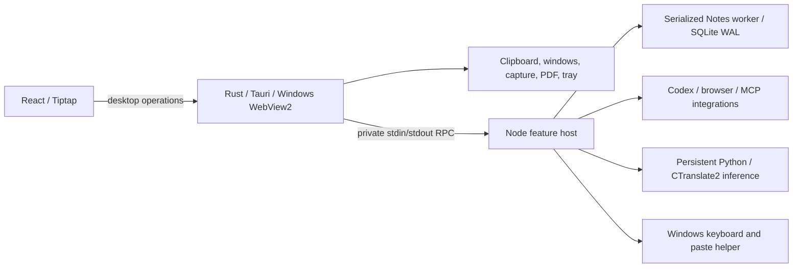

# Windows rework 0.2.0

The complete source state before this rework was pushed to `main` as
`d1966fec4cd346f4ea02e1355475bd817505c9cb` (0.1.118). Implementation is on
`codex/windows-native-rework`. User data, credentials, recordings and model weights
are excluded from Git.

## Architecture implemented

Rust owns operating-system integration and supervises the host process tree with
a Windows job object. Node retains working agent integrations and the SQLite
document service. Python retains CTranslate2 and the keyboard hook. These are
intentional feature processes. Webviews have no Node integration. The desktop
opens no network listener. Rewriting validated inference libraries in Rust would
add work without removing their underlying model costs.

The main window becomes visible after React paints, with its theme selected
synchronously. Notes do not depend on connecting an agent. Playwright, HTML
extraction and MCP initialization run only when used. Audio reaches Rust as binary,
rather than an expanded JSON array. Electron's shell, preloads, glass helpers,
asset protocol and packaging configuration have been removed.
The old NSIS artifact-cleanup command was retired with that packaging format.

Auxiliary windows have restricted commands; replies are scoped to the requested
window. Asset paths are canonicalized inside their registered import root.
Clipboard insertion waits for the keyboard helper's acknowledgement.

## Data ownership

`notes/workspace.sqlite` stores hierarchy/order, page metadata, Markdown projections,
rich documents, database definitions/rows and page versions. One worker serializes
operations. Revision checks and writes commit together; notifications follow the
commit. WAL uses full synchronous commits. Conversation persistence remains SQLite.

The first migration is one transaction. Old files remain as a recovery snapshot,
not a live second writer. All repeated history revision IDs are retained. Imported
attachment locations remain valid. Existing browser preferences were exported
privately and imported once into the new WebView profile on this machine.

Autosave updates selected metadata rather than rewriting the complete index. Page
lookup uses an ID map. Ordinary database views use indexed SQL pages capped at 100
rows. Formula, relation, rollup and filtered/sorted views keep the validated
computation engine. Complex mutations still validate the supplied database: this
release does not claim constant-time processing for every 50,000-row operation.

## Measured results

Ryzen 7 7700X, 32 GB RAM, NVMe, RTX 5060 Ti. Three launches per version, alternating
order, fresh application/browser profiles, the same collection of 2,159 active
notes and 113 databases. Model warmup and keyboard hooks were disabled in both
versions for this shell comparison. OS file caches were not cleared. These are
fresh-process measurements, not a reboot/cold-disk benchmark.

| Median | Preserved Electron 0.1.118 | Native 0.2.0 |
|---|---:|---:|
| Navigation UI available | 806.7 ms | 415.0 ms |
| First note editor available after migration | 1,700.5 ms | 1,389.1 ms |
| Process-tree private memory after opening Notes | 408.1 MiB | 393.3 MiB |

UI availability improved approximately 49%, editor availability 18%, and measured
shell memory only 4%. WebView2 still runs Chromium and the feature host uses Node.
Removing Electron does not make a rich web editor cost nothing.

One-time migration was measured separately: first editor availability was
4.48–9.01 seconds when migration was included. Direct migration of a copied
collection took about 0.94 seconds with cached files. That upgrade cost is excluded
from the regular-launch comparison.

Real large-v3 inference returned the expected fixture transcript through the new
application. Model memory and first GPU warmup remain substantial and are separate
from shell memory. The native executable is about 12 MB; the full GPU/inference
and agent payload occupies several GB. No smaller model was silently substituted.

Private measurements are under `runtime/startup-comparison-vMX9G4` and
`runtime/startup-comparison-EPD81Z`; copied user data is never published. A separate
comparison verified every document body, valid rich document/HTML, hierarchy,
database property/view/row and history record: 2,159 active notes, two trashed notes,
113 databases, four history files and SQLite integrity. The original profile was
backed up before activation.

Version 0.2.0 was then verified against the original profile: all active Notes and
databases loaded, all eight exported UI preferences matched, and the existing
large-v3 configuration produced the fixture transcript on NVIDIA CUDA. Start Menu
and sign-in shortcuts now launch the portable native executable directly. The
normal application was relaunched without the test debugging port or synthetic
audio flags.

## Validation

Real WebView2 tests cover painting/theme, rich typing/flush, autosave, stale
revision rejection, database editing, binary audio, synthetic-device microphone
capture, Unicode insertion into an owned foreground field, native PDF/capture,
attachments and traversal refusal, edge/overlay, scoped commands and graceful exit.
Synthetic WebRTC duplex tests prove capture closes on release while outgoing
silence and incoming audio continue, with fresh capture on the next hold.

Store/host checks cover database computations, safe imports, trash/restore, locks,
history, conflicting saves, worker close, project isolation, note tools,
authorization, undo, SQLITE_FULL conversation recovery, shortcuts, paste
acknowledgement, inference reuse/cancellation/crash recovery, managed OAuth and
actual Piper synthesis. Native tests replace retired Electron harnesses. The
editor's entire historical visual matrix has not been independently replayed in
this release. No third-party messages or paid live-agent turns were sent to test it.

## Android and iPhone direction

No mobile application or remote server was built here. Windows inference already
returns a transcript separately from clipboard insertion. The intended flow is
phone audio → authenticated Windows inference → returned text → phone insertion.
A remote inference request must never paste into the Windows foreground app.

Android needs native input-method integration for other apps:
[`InputConnection.commitText`](https://developer.android.com/reference/android/view/inputmethod/InputConnection)
and [Android input-method guidance](https://developer.android.com/develop/ui/views/touch-and-input/creating-input-method).
Microphone capture must obey foreground permission rules. A clipboard button in a
webview does not implement this flow.

iPhone needs separate capture and keyboard handoff: Apple's keyboard sandbox
[does not expose microphone access](https://developer.apple.com/documentation/uikit/configuring-open-access-for-a-custom-keyboard).
Do not promise the Android interaction unchanged on iOS.

Niwa Code's account-to-PC pattern can inform account discovery and outbound tunnel
transport. Use owner/device authorization, revocation and scoped credentials;
never copy long-lived Windows host secrets to phone storage. No new authentication
provider or tunnel is connected in this step.

The user selected cached reading **and editing** while Windows is offline. The
mobile phase needs local SQLite, durable operations, stable document IDs, revision
preconditions, idempotent replay and visible conflict handling. Concurrent rich
edits must not be silently overwritten. Inference needs Windows online; pending
recordings need a clear state and user-controlled retry. Share transport DTOs and
capabilities, keeping window, clipboard and GPU code platform-specific. Language
selection uses provider codes, not keyword-based intent rules.

Further performance work should follow measured slow interactions: database
mutation size, large rich documents, cold GPU readiness and model memory. Mobile
capture, login and offline synchronization are subsequent work.
